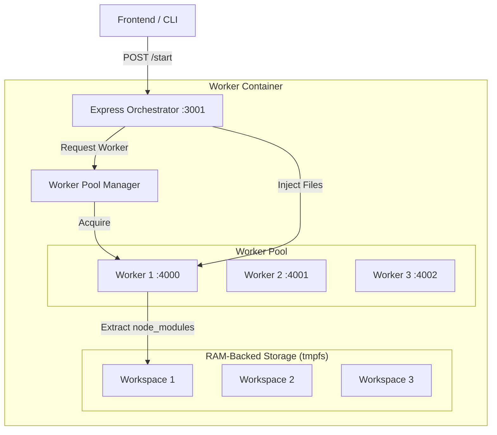

# AI Preview Worker - System Design & Architecture

This document provides a deep dive into the internal architecture of the **AI Preview Worker**. It explains how we achieve 1-3 second boot times for Next.js previews using a pre-warmed pool and session-aware recycling.

---

## 🏗️ High-Level Architecture

The system is designed as a high-performance "Runner" that can execute arbitrary Next.js code in isolated environments.

---

## 🧩 Key Components

### 1. The Orchestrator (`index.js`)
The external entry point. It handles:
- **Routing**: Mapping incoming HTTP requests to specific workers.
- **Session Tracking**: Mapping `projectId` to `workerId`.
- **Recycling**: Identifying when a user is starting a "new" preview for the same project and killing the old worker before assigning a new one.

### 2. Worker Pool Manager (`WorkerPool.js`)
The "Brain" of the system. It maintains the health of the pool:
- **Pre-Warming**: Keeps `POOL_MIN` workers ready and "Warm" (Next.js server running and waiting).
- **Port Management**: Assigns unique ports (4000-5000) to each worker.
- **Replenishment**: Detects when a worker is acquired or dies and spawns a replacement in the background.
- **Graceful Cleanup**: Ensures that when a worker exits, its RAM-backed files are deleted instantly.

### 3. Worker Instance (`worker.js`)
A single isolated Node.js process that represents one preview session.
- **Snapshot Extraction**: Instead of `npm install`, it extracts a pre-built `node_modules-snapshot.tar.gz` into `/tmp` (RAM). This reduces boot time from 60s to 2s.
- **Dual Servers**:
    - **Control Server**: A small Express app that listens for the `/__inject` command to write code to disk.
    - **Preview Server**: The actual Next.js dev server running the user's code.

---

## 🔄 The Lifecycle of a Preview

1.  **Pre-Warm**: On startup, the Pool Manager spawns 3 workers. Each worker creates a unique folder in `/tmp`, extracts 350MB of modules, and starts `next dev`.
2.  **Acquire**: User clicks "Preview". The Orchestrator grabs a "Warm" worker from the queue.
3.  **Inject**: The Orchestrator sends the user's code files to the Worker's `/__inject` endpoint.
4.  **HMR**: Next.js detects the new files on disk and refreshes the internal server.
5.  **Proxy**: All subsequent requests from the user's browser are proxied through the Orchestrator to that specific worker.
6.  **Recycle**: If the user clicks "Preview" again, the old worker is killed, `/tmp` is wiped, and a fresh warm worker is assigned.

---

## 🚀 Performance Optimizations

### ⚡ RAM-Backed Storage (`tmpfs`)
We mount `/tmp` as a `tmpfs` volume in Docker.
- **Speed**: File I/O happens in RAM, making tar extraction and HMR near-instant.
- **Durability**: We avoid wearing out the EC2 instance's SSD.
- **Cleanup**: Files vanish the moment the process or container stops.

### 📦 node_modules Snapshotting
We don't run `npm install` inside workers. We use a pre-built tarball of `node_modules`.
- **Consistency**: Every worker starts with the exact same dependencies.
- **Isolation**: Workers don't share `node_modules` folders (which prevents "Module not found" errors during HMR).

---

## 🛡️ Stability & Resource Management

| Feature | Implementation | Purpose |
| :--- | :--- | :--- |
| **Memory Limit** | 3GB Hard Cap | Prevents a single rogue Next.js app from crashing the EC2 instance. |
| **Session Awareness** | `projectId` Mapping | Prevents "Zombie Workers" when a user clicks the button multiple times. |
| **Health Checks** | Docker `healthcheck` | Orchestrator verifies it can reach workers before reporting "Healthy". |
| **Self-Healing** | `restart: unless-stopped` | Auto-restarts the entire pool if the Orchestrator crashes. |

---

## 🛠️ Network Mapping

- **Port 3001**: Orchestrator API (The only port exposed to the internet).
- **Ports 4000-4050**: Individual Next.js worker servers (Internal or proxied).
- **Ports 14000-14050**: Next.js HMR/WebSocket ports (Proxied).

The Orchestrator uses `http-proxy-middleware` to route traffic based on the `:workerId` in the URL:
`GET /api/preview/proxy/w-123/static/logo.png` → `GET http://localhost:4005/static/logo.png`
