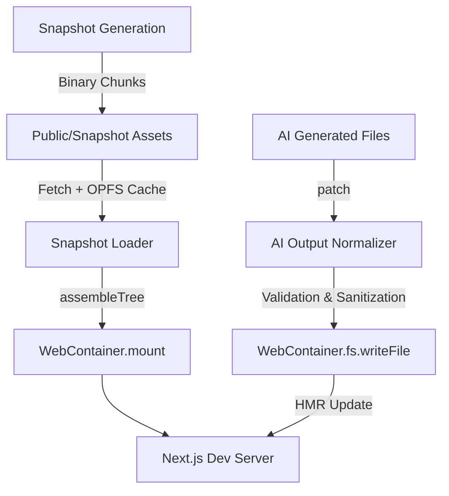

# WebContainer SDK Integration Guide (Agent-Optimized)

> [!NOTE]
> This document is optimized for both **Engineers** and **AI Coding Agents**. It provides a structured map of the runtime architecture and clear extension points for modification.

---

## 🏗️ Architecture Overview

The runtime operates on a **Base + Patch** model to achieve sub-3s boot times.



---

## 📂 File Responsibility Map

| File Path | Responsibility | Modification Trigger |
| :--- | :--- | :--- |
| `webcontainer-client.js` | Lifecycle management (boot, spawn, reset). | Changing dev server port or spawn command. |
| `snapshot-loader.js` | Binary chunk orchestration & OPFS caching. | Changing chunk asset location or caching logic. |
| `ai-output-normalizer.js` | Security guardrails & code sanitization. | Adding forbidden files or new regex import rules. |
| `useWebContainer.js` | React state binding and proactive boot. | Adding new status states or custom error handling. |
| `generate-binary-chunks.js`| Build-time snapshot creation. | Changing pruning rules for node_modules. |

---

## 🔧 AI Agent Instruction Set (Extension Points)

### 1. Adding a Restricted File (Guardrails)
To prevent the AI from modifying a specific file, modify `ai-output-normalizer.js`:
```javascript
// Add to FORBIDDEN_FILES array
const FORBIDDEN_FILES = [..., 'sensitive-config.json'];
```

### 2. Adding a New Code Sanitization Rule
To modify AI-generated code before it hits the filesystem, update the `normalizeContent` method in `ai-output-normalizer.js`:
```javascript
normalizeContent(content) {
  // Example: Replace hardcoded API keys or fix broken imports
  return content.replace(/pattern/g, 'replacement');
}
```

### 3. Modifying the Dev Server Command
To change how Next.js starts (e.g., adding flags), update `webcontainer-client.js`:
```javascript
// Modify the jsh command in startDevServer
const process = await this.instance.spawn('jsh', ['-c', 'node ./node_modules/next/dist/bin/next dev --port 3001']);
```

---

## 📡 Backend Integration Specs

The runtime expects a flat file map from the AI generation backend.

**Protocol Schema:**
```typescript
interface AIResponse {
  files: {
    [path: string]: string; // Key: Relative Path, Value: File Content
  }
}
```

**Normalization Requirement:**
Paths should be relative to the project root (e.g., `app/page.js`, not `/app/page.js`).

---

## 🛠️ Build-Time Snapshot Configuration

If you add new core dependencies (e.g., `framer-motion`), you must re-generate the snapshot:

1. Update `template/package.json`.
2. Run `npm install` inside `template/`.
3. Execute:
   ```bash
   node packages/webcontainer-runtime/scripts/generate-binary-chunks.js
   ```

---

## 🛑 Critical Constraints for Agents

1. **NO Arbitrary npm installs**: The runtime is optimized for snapshot reuse. Do not attempt to run `npm install` inside the WebContainer at runtime.
2. **SharedArrayBuffer Requirement**: The hosting environment MUST serve COOP/COEP headers. If the runtime fails to boot, verify headers in the Network tab.
3. **Binary Integrity**: Do not modify `.wasm` chunks manually. Always use the generation script.

---

## 🤖 Context Injection Map (For AI Agents)

If you are passing this project to an in-IDE AI Agent (like Cursor, Windsurf, or Antigravity), provide the following files as context to ensure it understands the runtime logic perfectly:

| Priority | File Path | Why? |
| :--- | :--- | :--- |
| **High** | `packages/webcontainer-runtime/src/lib/webcontainer-client.js` | Core lifecycle and process spawning logic. |
| **High** | `packages/webcontainer-runtime/src/lib/ai-output-normalizer.js` | Critical for understanding security guardrails. |
| **Med** | `packages/webcontainer-runtime/src/hooks/useWebContainer.js` | Explains how the frontend binds to the runtime. |
| **Med** | `packages/webcontainer-runtime/src/lib/snapshot-loader.js` | Understanding the binary chunking & OPFS system. |
| **Low** | `packages/webcontainer-runtime/scripts/generate-binary-chunks.js` | Only needed for build-time snapshot changes. |

**Recommended Prompt for Agent:**
> "I am working with an optimized WebContainer-based AI runtime. Use the provided context files to understand how snapshots are restored and how AI-generated files are normalized before being written to the filesystem. Adhere to the security constraints in `ai-output-normalizer.js`."
