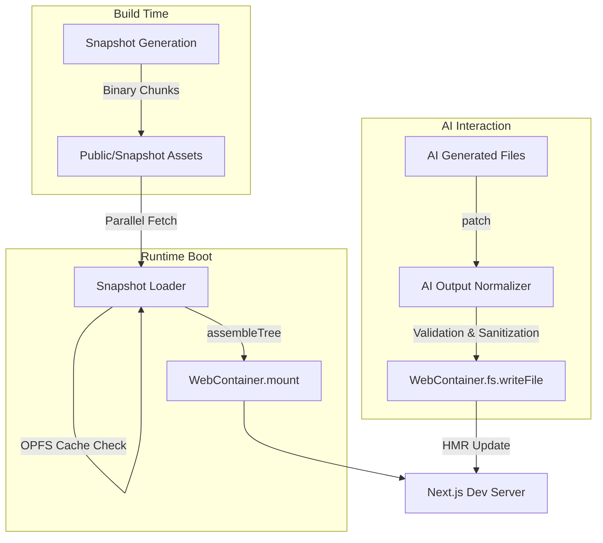

# 🛠️ WebContainer SDK Integration Guide

> [!NOTE]
> This document is a technical blueprint optimized for both **Engineers** and **AI Coding Agents**. It maps the runtime architecture and defines clear extension points for customization.

---

## 🏗️ Architecture Overview

The runtime utilizes a **Base + Patch** model to achieve lightning-fast boot times by minimizing filesystem operations at startup.



---

## 📂 File Responsibility Map

| File Path | Primary Responsibility | Modification Trigger |
| :--- | :--- | :--- |
| `webcontainer-client.js` | Lifecycle (boot, spawn, reset). | Changing dev server port or start command. |
| `snapshot-loader.js` | Binary orchestration & OPFS caching. | Changing chunk locations or caching logic. |
| `ai-output-normalizer.js` | Security & code sanitization. | Adding forbidden files or regex import rules. |
| `useWebContainer.js` | React bindings & proactive boot. | Adding new states or custom error handling. |
| `generate-binary-chunks.js`| Build-time snapshot creation. | Updating dependency pruning rules. |

---

## 🔧 AI Agent Instruction Set (Extension Points)

### 🛡️ 1. Strengthening Guardrails
To prevent the AI from modifying a specific file, update the `FORBIDDEN_FILES` array in `ai-output-normalizer.js`:
```javascript
// Example: Protecting a new security config
const FORBIDDEN_FILES = [..., 'security-policy.json'];
```

### 🧹 2. Custom Code Sanitization
Modify AI-generated code before it reaches the container by updating the `normalizeContent` method:
```javascript
normalizeContent(content) {
  // Example: Auto-fixing common AI import errors
  return content.replace(/from 'react-icons\/(.*)'/g, "from 'lucide-react'");
}
```

### ⚙️ 3. Tuning the Dev Server
To adjust how the Next.js server starts, modify the `startDevServer` method in `webcontainer-client.js`:
```javascript
// Adding a custom port and experimental flags
const process = await this.instance.spawn('jsh', [
  '-c', 
  'node ./node_modules/next/dist/bin/next dev --port 3001 --turbo'
]);
```

---

## 🛑 Critical Constraints

1.  **Immutability Strategy**: The runtime is optimized for snapshot reuse. **DO NOT** attempt to run `npm install` inside the WebContainer at runtime; use the pre-built `node_modules` layer.
2.  **Environment Security**: The hosting environment **MUST** serve `COOP` (Cross-Origin-Opener-Policy) and `COEP` (Cross-Origin-Embedder-Policy) headers to enable `SharedArrayBuffer`.
3.  **Path Consistency**: The AI backend must provide paths relative to the project root (e.g., `app/page.js`).

---

## 🤖 Context Injection (For Agents)

When working with an AI Agent (Cursor, Windsurf, Antigravity), provide these files as context for optimal results:

- **Core Lifecycle**: `packages/webcontainer-runtime/src/lib/webcontainer-client.js`
- **Security Logic**: `packages/webcontainer-runtime/src/lib/ai-output-normalizer.js`
- **Frontend Hook**: `packages/webcontainer-runtime/src/hooks/useWebContainer.js`
- **Snapshot Logic**: `packages/webcontainer-runtime/src/lib/snapshot-loader.js`

> [!TIP]
> **Recommended Agent Prompt:**
> "Analyze the provided WebContainer runtime context. Adhere to the security constraints in `ai-output-normalizer.js` and ensure all filesystem writes are relative to the root. Do not suggest runtime `npm install` commands."

